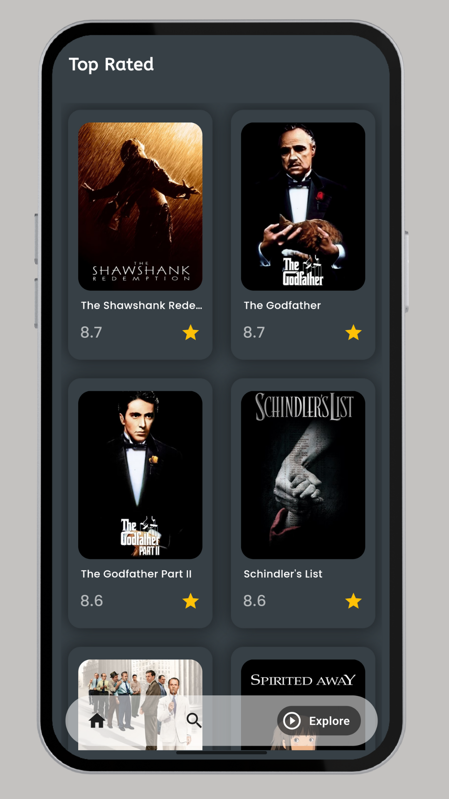

# cinestream

A new Flutter project.

# Overview
Welcome to the Movie App, a Flutter-based application that provides an immersive cinematic experience right at your fingertips. Utilizing the powerful TMDB API and Provider state management, this app delivers a seamless user experience with a stunning user interface. Discover movies currently playing in theaters, top-rated films, upcoming releases, and personalized recommendations. You can also search for any movie and find exact matches and related titles.

# Features
Now Playing: Stay updated with movies currently playing in theaters worldwide.
Top Movies: Explore a curated list of top-rated films based on user ratings and reviews.
Upcoming Movies: Get a sneak peek at upcoming releases and plan your next cinema visit.
Recommendations: Receive personalized movie recommendations tailored to your preferences.
Search Functionality: Effortlessly search for any movie and find exact matches, along with related titles.

# Technologies Used

Flutter: The app is built using Flutter, Google's UI toolkit, which allows for fast development of beautiful native interfaces for both Android and iOS.

TMDB API: The app fetches movie data from The Movie Database (TMDB) API, providing detailed information about movies, including ratings, genres, casts, trailers, and more.

Provider State Management: This app utilizes the Provider package for efficient state management, ensuring a smooth and responsive user experience.

Dart Programming Language: The app is developed using Dart, which is the programming language behind Flutter.

## Screenshots

  
  
  
    
  

# Contributing
Contributions are welcome! If you'd like to contribute, please follow these guidelines:

Fork the repository.
Create a new branch for your feature or bugfix.
Commit your changes and push to your forked repository.
Open a pull request with a detailed description of your changes.
License
This project is licensed under the MIT License. See the LICENSE file for details.

# Acknowledgments
Special thanks to TMDB for providing a comprehensive API.
Thanks to the Flutter community for providing excellent resources and support.
Contact
If you have any questions or suggestions, feel free to reach out:

Email: imrankhattak1212@example.com

GitHub: Imran-khattak

This project is a starting point for a Flutter application.

A few resources to get you started if this is your first Flutter project:

- [Lab: Write your first Flutter app](https://docs.flutter.dev/get-started/codelab)
- [Cookbook: Useful Flutter samples](https://docs.flutter.dev/cookbook)

For help getting started with Flutter development, view the
[online documentation](https://docs.flutter.dev/), which offers tutorials,
samples, guidance on mobile development, and a full API reference.
